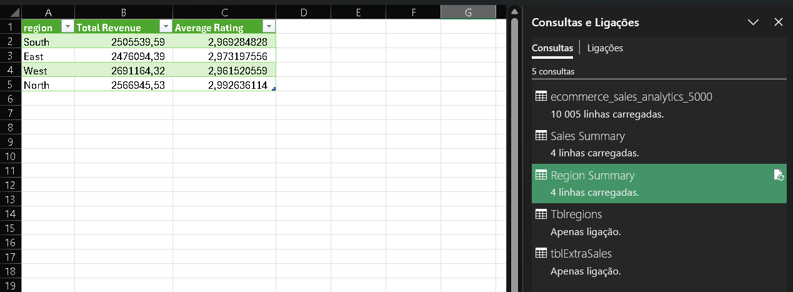

# 📊 E-commerce Sales Analysis

## About

This project demonstrates data cleaning and transformation using Microsoft Excel Power Query.

## Dataset

The dataset contains e-commerce sales information, including:

- Order ID
- Order Date
- Customer ID
- Product Category
- Region
- Quantity
- Unit Price
- Discount
- Payment Method
- Delivery Days
- Customer Rating
- Revenue

## Tasks Performed

- Imported CSV data
- Converted data types
- Used locale settings for dates and decimal numbers
- Removed duplicate records
- Removed blank rows
- Sorted data by revenue
- Filtered product categories
- Created a custom "Final Price" column
- Created a custom "Delivery Status" column
- Loaded transformed data into Excel
- Configured automatic refresh
- Created conditional columns
- Merged region manager table
- Appended additional orders
- Created summary tables

## Skills Used

- Microsoft Excel
- Data Aggregation
- Power Query
- Data Cleaning
- Append Queries
- Merge Queries
- Group By
- Data Transformation
- Data Validation
- Filtering
- Sorting
- Custom Columns
- Conditional Columns
- Data Refresh
  ## Screenshots

### Power Query Editor

### Final Table

### Region Summary

## Author

Nuno Almeida
